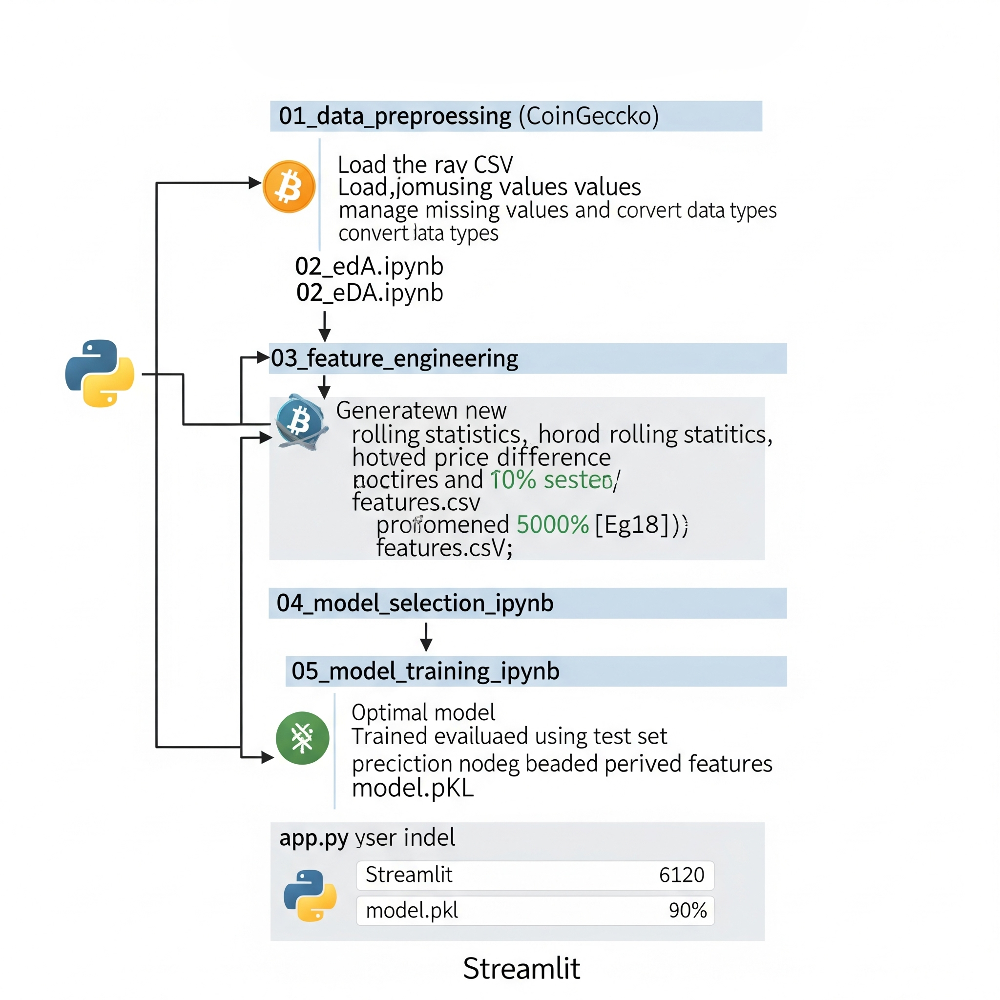
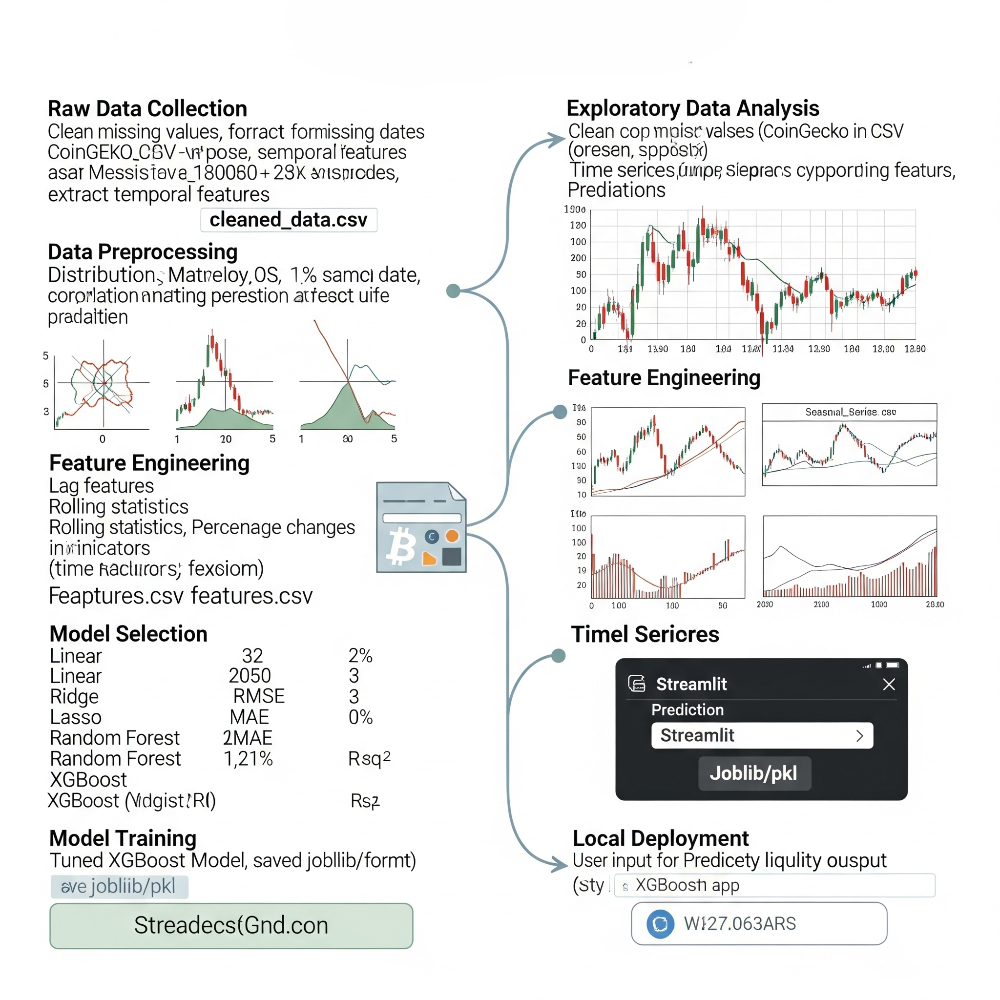

# 📊 Cryptocurrency Liquidity Prediction Project

This project predicts the **liquidity** (via `price`) of cryptocurrencies using historical CoinGecko data. It applies data preprocessing, feature engineering, and machine learning (XGBoost) to forecast market behavior and identify liquidity risks.

---

## 🚀 Objective

To develop a full-stack machine learning system that:
- Ingests and processes cryptocurrency data
- Performs exploratory analysis and creates engineered features
- Trains and evaluates ML models
- Deploys a Streamlit app for real-time prediction

---

## 🔗 Dataset

Access raw data CSVs directly from the GitHub repo:  
📁 [data/raw/](https://github.com/Prabal729/cryptocurrency_price_prediction/tree/main/data/raw)

---

## 🧠 ML Pipeline Summary

- Preprocessing of historical CSVs from CoinGecko
- EDA with trends, distributions, and correlation analysis
- Feature engineering using time-based and technical indicators
- Model selection with evaluation metrics (MAE, RMSE, R²)
- Hyperparameter tuning using GridSearchCV
- Deployment via Streamlit app

---

## ⚙️ How to Run

1. **Clone the repository**  
```bash
git clone https://github.com/Prabal729/cryptocurrency_price_prediction.git
cd cryptocurrency_price_prediction
```
2. **Install dependencies**
```
pip install -r requirements.txt
```
3. **Launch Streamlit App**
```
streamlit run app.py
```
4. **Provide Input**
Use the sidebar to enter numerical features. Get live predictions using the trained XGBoost model.

📁 Project Structure
```
cryptocurrency_price_prediction/
├── data/
│   ├── raw/
│   └── processed/
├── notebooks/
│   ├── 01_data_preprocessing.ipynb
│   ├── 02_eda.ipynb
│   ├── 03_feature_engineering.ipynb
│   ├── 04_model_selection.ipynb
│   ├── 05_model_training.ipynb
├── src/
│   ├── data_loader.py
│   ├── data_processor.py
│   ├── evaluator.py
│   ├── feature_engineer.py
│   ├── models.py
├── models/
│   ├──feature_columns.pkl
│   ├── final_xgboost_model.pkl
├── reports/
│   ├── eda_report.pdf
│   ├── hld_document.pdf
│   ├── lld_document.pdf
│   ├── pipeline_architecture.pdf
│   └── final_report.pdf
├── app.py
└── README.md

```

## 📸  Architecture

#🧱 High-Level Design (HLD):


🛠️ Low-Level Design (LLD)

🔁 Pipeline Architecture

